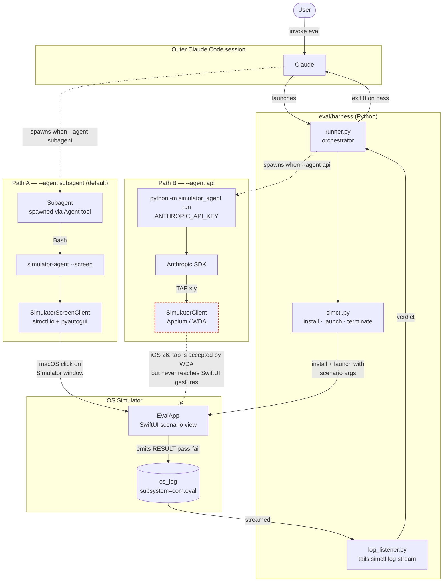

# iClaude

Autonomous AI agent for iOS — Simulator and real devices via Appium.

## Setup

```bash
# Install iClaude
pip install -e .

# Install Appium + iOS driver
npm install -g appium && appium driver install xcuitest

# Start the Appium server
appium --relaxed-security --port 4723
```

## Usage

Set your device env vars:
```bash
export SIMULATOR_UDID=booted
export SIMULATOR_BUNDLE_ID=<your-app-bundle-id>
```

Then ask Claude Code to interact with your app. Claude uses the `simulator_agent` CLI under the hood to observe the screen, tap elements, type text, and swipe — all autonomously.

## Modes

iClaude supports two observation modes:

- **Vision + Elements** (default) — takes a screenshot and reads the accessibility element tree. The agent gets exact element labels, types, and coordinates. More reliable.
- **Vision-only** (`--vision-only`) — screenshot only, no element tree. The agent must interpret the image and estimate tap coordinates from pixels. Useful for benchmarking visual reasoning.

## Agent

The current agent implementation is a naive agentic loop: observe → send elements to Claude → parse action → execute → repeat. It calls the Anthropic API with task-specific instructions provided by the user.

```bash
# Write your instructions in a markdown file, then:
python demos/trivia/run.py
```

See [demos/](./demos/) for examples.

## Demo

Tested with [TriviaQuizApp](https://github.com/nealarch01/TriviaQuizApp) — a SwiftUI trivia game played fully autonomously.

## Eval

Parameterized scoring loop under [`eval/`](./eval/). A purpose-built SwiftUI app (`EvalApp`) renders one scenario per launch with knobs for difficulty (target size, position, distractors, etc.) and emits structured `RESULT pass|fail` lines via `os_log`. A Python harness installs the app, launches it with scenario args, and waits for the result.

The **default agent mode is `subagent`** — meaning the outer Claude Code session is expected to spawn a subagent that drives the simulator through the `simulator-agent` CLI primitives (`tap`, `screenshot`, `swipe`, …). No `ANTHROPIC_API_KEY` is needed; Claude Code's existing credentials handle the model calls.

```bash
# Build the app once (rebuild whenever Swift sources change).
make -C eval/EvalApp build

# Stage a scenario and wait for a subagent (driven by the outer Claude Code session) to solve it.
python3 -m eval.harness.runner --size 80

# Smoke-test the harness without any agent (expects timeout).
python3 -m eval.harness.runner --size 80 --app-timeout-s 3 --agent none

# Fallback: spawn a standalone agent that calls the Anthropic SDK directly.
ANTHROPIC_API_KEY=... python3 -m eval.harness.runner --size 80 --agent api
```

### Architecture



**Key flows on the diagram:**

- The **harness/signal loop** (Runner → Sctl → EvalApp → OSLog → LogListener → Runner) is shared by both paths. The agent's job is only to deliver the right tap; the verdict is decided by the app and observed by the harness.
- **Path A** is the default: an outer Claude Code session spawns a subagent (no API key required), which uses `simulator-agent --screen` to click directly on the Simulator.app window via `pyautogui`. This bypasses WDA entirely.
- **Path B** is the fallback: the harness spawns a standalone `simulator_agent run` that calls the Anthropic SDK. It currently goes through Appium/WDA, which on iOS 26 returns 200 OK for taps but the touches never reach SwiftUI's gesture handlers (the dashed red edge). For SwiftUI eval targets, point Path B at `--screen` too.

## Credits

`apps/TriviaQuizApp/` is vendored from [TriviaQuizApp](https://github.com/nealarch01/TriviaQuizApp) by Neal Archival, used under the MIT License. See [`apps/TriviaQuizApp/LICENSE`](./apps/TriviaQuizApp/LICENSE).
